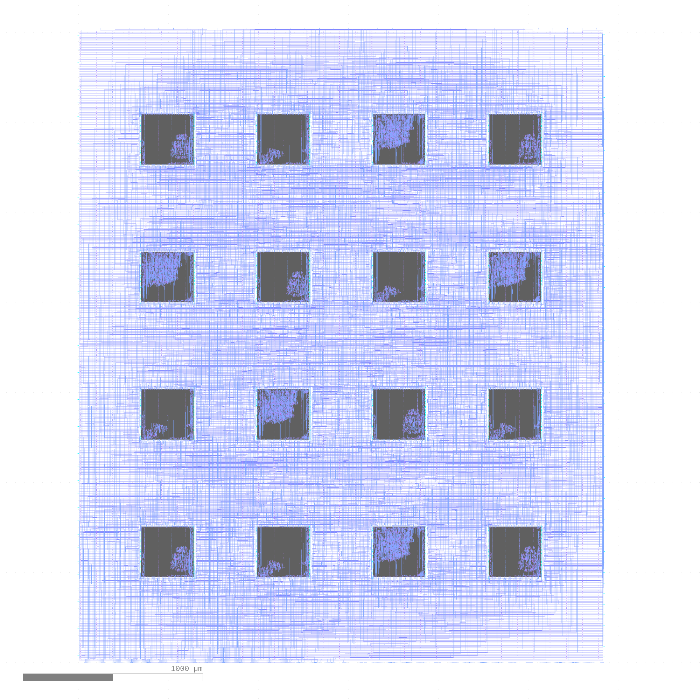

# Multi project tools

A tool to help automate verification of sub projects and collect and harden them into the final submission.

* Project outputs isolated with tristate buffers
* Projects are activated by the Caravel logic analyser
* Partial support for [OpenRAM](docs/openram.md)

Projects must conform to the [specification](docs/project_spec.md). 

See this [generated index page](https://github.com/mattvenn/zero_to_asic_mpw3/blob/mpw3/README.md) for some example projects.

See this repo you can use as a template: https://github.com/mattvenn/wrapped_project_template

## Schematic

The shared bus contains the following signals:

    // Caravel Bus
    input wire          wb_clk_i,                   // main clock
    input wire          wb_rst_i,                   // main system reset
    input wire          wbs_stb_i,                  // wishbone write strobe
    input wire          wbs_cyc_i,                  // wishbone cycle
    input wire          wbs_we_i,                   // wishbone write enable
    input wire  [3:0]   wbs_sel_i,                  // wishbone write word select
    input wire  [31:0]  wbs_dat_i,                  // wishbone data in
    input wire  [31:0]  wbs_adr_i,                  // wishbone address
    output wire         wbs_ack_o,                  // wishbone ack
    output wire [31:0]  wbs_dat_o,                  // wishbone data out

    // RAMBus
    output wire         rambus_wb_clk_o,            // clock
    output wire         rambus_wb_rst_o,            // reset
    output wire         rambus_wb_stb_o,            // write strobe
    output wire         rambus_wb_cyc_o,            // cycle
    output wire         rambus_wb_we_o,             // write enable
    output wire [3:0]   rambus_wb_sel_o,            // write word select
    output wire [31:0]  rambus_wb_dat_o,            // ram data out
    output wire [9:0]   rambus_wb_adr_o,            // 10bit address
    input  wire         rambus_wb_ack_i,            // ack
    input  wire [31:0]  rambus_wb_dat_i,            // ram data in

    // Logic Analyzer Signals
    input  wire [31:0] la1_data_in,
    output wire [31:0] la1_data_out,
    input  wire [31:0] la1_oen,

    // GPIOs
    input  wire [`MPRJ_IO_PADS-1:0] io_in,
    output wire [`MPRJ_IO_PADS-1:0] io_out,
    output wire [`MPRJ_IO_PADS-1:0] io_oeb,

    // IRQ
    output wire [2:0] irq,

    // Clock 2
    input wire user_clock2,
   
Each project is connected to one bit of the active bus:

    // active input, only connect tristated outputs if this is high
    input wire active [31:0]

When the active wire goes high, the wrapper's outputs are switched from high-z to the project's outputs.

## Optional interfaces

Wishbone, LA1, GPIO, IRQ, Clock2, RAMBus, CaravelBus are all optional. You can turn them off if you don't need them.

## Dependencies

* caravel_user_project with OpenLANE & PDK installed as given in instructions.
* projects.yaml file with correct paths
* netgen local install: https://github.com/RTimothyEdwards/netgen (version 1.5.205)- TODO use the one in the OpenLANE docker

See the requirements.txt file for Python reqs.

## Config file

[projects.yaml](projects.yaml) contains a list of projects and system wide config.

LVS tests now require a tool inside OpenLANE to parse the output of netgen.

## Setup

    # includes OpenRAM
    ./multi_tool.py --clone-repos --clone-shared-repos --create-openlane-config --copy-gds --copy-project --openram

This command will get everything ready for a complete system test and hardening of user_project_wrapper:

* Copy each project's GDS/LEF/RTL/tests to the correct place in Caravel
* Generate OpenLANE configuration for user_project_wrapper (macro placement and obstructions)
* Instantiate all the projects inside user_project_wrapper.v

This functionality is contained within the [Collection class](collect.py)

## Test everything

     ./multi_tool.py --test-all --force-delete

This command will run all the tests against all projects: 

* Check config file
* Runs a module test given Makefile and recipe
* Runs the Caravel simulation given Makefile and recipe
* Runs formal proof on wrapper tristated outputs
* Checks GDS nothing on layer metal 5
* Run LVS against powered Verilog and GDS - requires new netgen
* Checks powered Verilog has Z outputs if not active
* Check repos match the given commit

This functionality is contained within the [Project class](project.py)

To choose a single project, provide the --project argument.

## Gate level testing

This isn't full system GL testing as it takes too long. Instead, only the GL version of the projects are used. The rest of Caravel is assumed to be 
working and the Verilog is used.

    # rebuild include files for gatelevel so that the files in verilog/gl are included instead
    ./multi_tool.py --create-openlane-config --gatelevel

    # run all the caravel tests with gl
    ./mutli_tool.py --test-caravel

## Generate documentation

    ./multi_tool.py --generate-doc --annotate-image

* Generates a project index (index.md) with details of all the projects
* copies the project images to ./pics
* uses klayout to grab a screenshot of the final layout
* annotate the layout with titles and authors, saves as ./pics/multi_macro_annotated.png

## Done by hand

run OpenLane to harden user_project_wrapper:

    cd $CARAVEL_ROOT; make user_project_wrapper

The above was generated with config created by this command that fills all 16 slots with repeated projects:

    ./multi_tool.py --copy-gds  --create-openlane-config --fill 16 --force-delete

* Caravel was installed by caravel_user_project
* OpenLANE as installed by caravel_user_project
* took 13 minutes to complete on 3GHz with 4 cores and 32GB RAM.
* LVS & DRC clean
* main config adjustment was GLB_RT_ADJUSTMENT set to 0.8

## TODO

* put tool command that generated config into the readme
* check license in projects
* one of the tests make a results.xml in local directory
